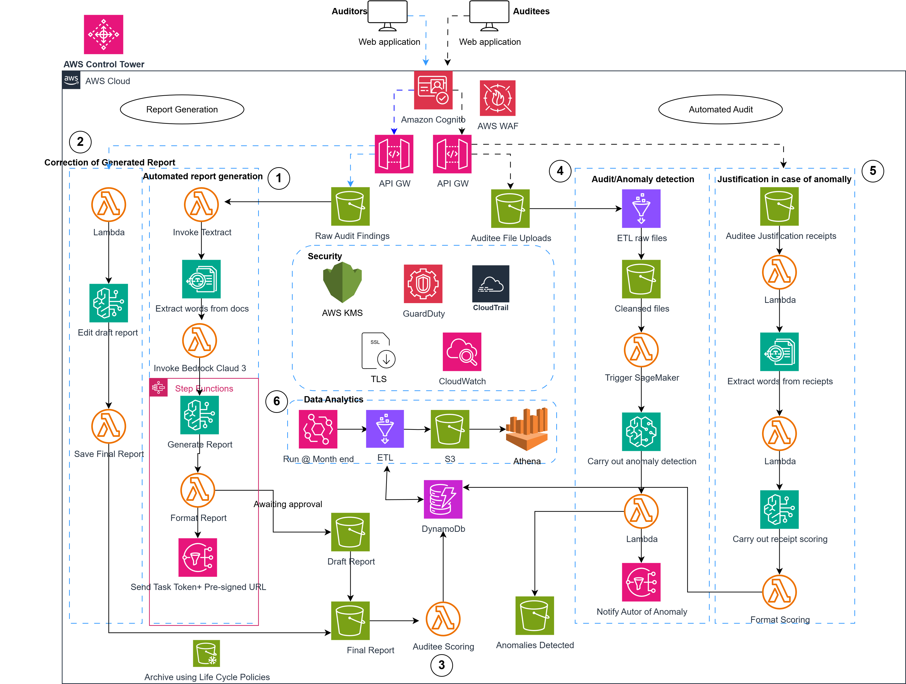

# 📄 Automated Audit Report Generation & Anomaly Detection (AWS Architecture)

This project showcases a cloud-native solution designed to automate the  generation of internal audit reports from hand writen notes and score auditees based on pre-set parameters. It also modernizes audit preparation through automated anomaly detection, receipt verification, and smarter field visit prioritization using cloud-based AI and analytics tools.The architecture demonstrates serverless orchestration, secure data handling, and AI/ML integration for scalable compliance workflows. 

---

## ⚙️ Architecture Components

- **Amazon S3** – stores uploaded audit findings and well as audit files
- **Amazon Textract** – extracts text from scanned PDFs and documents
- **AWS Lambda** – orchestrates processing and triggers AI workflows
- **Amazon SageMaker / Bedrock** – performs report generation, auditee scoring and anomaly detection
- **AWS Step Functions** – coordinates multi-stage processing and scoring (Wait state for human review)
- **Amazon EventBridge** – triggers data analytics workflows upon S3 upload events
- **DynamoDB** – stores metadata and anomaly scores
- **Amazon Athena** – allows querying stored results and analytics
- **Security Layer** – KMS for encryption, IAM for access control, WAF, GuardDuty, CloudTrail & CloudWatch for monitoring and compliance
- **Amazon Glue** - Carries out ETL on data for anomaly detection and data analytics

---

## 🗺️ Architecture Diagram



---

## 🚀 How to Deploy (AWS CLI)

```bash
aws cloudformation create-stack \
  --stack-name AuditAnomalyStack \
  --template-body file://cloudformation/audit_pipeline.yaml \
  --parameters file://template-params.json \
  --capabilities CAPABILITY_IAM
  ```
## 🔄 Workflow Breakdown

The system supports **two major flows**: audit report generation and anomaly detection. Below is a step-by-step breakdown:

### 🧾 Audit Report Generation Flow

1. **Upload Trigger**  
   Auditor uploads `audit-findings.pdf` to an S3 bucket

2. **Event Detection**  
   AWS Lambda detects the new file by way of S3 event notification and triggers the pipeline

3. **Text Extraction**  
   AWS Lambda invokes Amazon Textract to extract structured text from the document

4. **Report Generation**  
   The extracted text is forwarded to Amazon Bedrock Claude 3  for:
   - Structured audit report generation  
   - Auditee scoring based on compliance criteria

5. **Report Formating**
    AWS Lambda formats the generated report into a structured pre-designed template set by the auditors 

6. **Storage & Output**  
   Final reports is stored in S3 and scoring data stored in DynamoDB for persistence  

7. **Notification**
    Once a draft report is created it is stored in a draft S3 bucket and a pre-signed URL generated and sent via SNS to the Auditor alongside a Task Token. Once reviewed the final report is stored in a final report bucket.

8. **Orchestration**
    StepFunction orchestrates the process of report generation, formating, auditee scoring, wait state and human approval as well as final storage.

9. **Logging & Monitoring**  
   CloudWatch captures logs and metrics for visibility and debugging  
   CloudTrail maintains a full audit trail of activity

---

### ⚠️ Anomaly Detection Flow

1. **Data Collection**  
   Processed audit data and metadata are retrieved for analysis

2. **Detection Logic**  
   Lambda triggers SageMaker anomaly detection model to scan for irregularities:
   - Unusual values  
   - Threshold violations  
   - Patterns suggesting potential fraud or misreporting

3. **Scoring & Insights**  
   Detected anomalies are scored for severity  
   Results saved in DynamoDB for historical analysis

4. **Analytics Access**  
   Analysts query anomaly data using Athena for reports or dashboards

5. **Security Controls**  
   IAM roles restrict access to sensitive outputs  
   GuardDuty, KMS, and WAF provide extra protection on data flow


## 📂 Repo Structure

```bash
.
├── README.md
├── architecture.png
├── changelog.md
├── template-params.json
└── cloudformation/
    └── audit_pipeline.yaml

## 📄 License
This project is for personal and educational use by Walson, a certified AWS Solutions Architect.

## 📬 Contact
Built by Walson – aspiring ML/AI Engineer http://www.linkedin.com/in/mboewalsonbaiye


